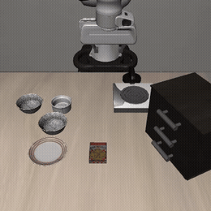
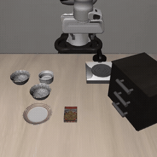

# Backstop

**Runtime failure prediction for Vision-Language-Action robot policies.**

A VLA policy takes camera images and a natural-language instruction and emits robot
actions directly. It generalises impressively, and it fails silently — the policy does
not know it is about to close the gripper on empty air. It emits the same well-formed
action stream either way.

Backstop is the supervisory layer: a runtime monitor that predicts execution failure
*before* the arm commits to it. It does not replace the policy. It watches the policy
and decides whether to trust the next action chunk.

---

## The problem, in two clips

Same task, same policy, adjacent starting scenes. Nothing in the policy's output
distinguishes them.

| Success — 100 steps | Failure — 280 steps (timeout) |
|:---:|:---:|
|  |  |
| Grasps the bowl, places it on the plate | Approaches, never secures the bowl, runs out the clock |

*Both from the recorded corpus, LIBERO-Spatial task 0, seeds 0 and 1. Failure clip is
2× speed. Camera is the agentview render at 20 Hz.*

The policy is equally confident in both. An operator watching only the action stream
has no signal that the second episode is going wrong. That missing signal is the
project.

---

## Status

**Week 1 of 6 complete: rollout infrastructure and reproduced baseline.**

There is **no guard yet**. Weeks 1–2 build the corpus the guard will be trained and
evaluated against. Signals land in Week 3.

### Reproduced baseline

`HuggingFaceVLA/smolvla_libero` (frozen) on LIBERO-Spatial, 10 tasks × 10 episodes:

| | |
|---|---|
| **Policy success rate** | **70.0%** (70/100) |
| Tolerance band (set before any number existed) | 70–90% |
| Failures | 30, **all** at the 280-step cap |
| Corpus | 100 episodes, 15,880 frames |

Per-task, showing that difficulty is very unevenly distributed:

| task | 0 | 1 | 2 | 3 | 4 | 5 | 6 | 7 | 8 | 9 |
|---|---|---|---|---|---|---|---|---|---|---|
| success | 8/10 | 8/10 | 8/10 | **4/10** | 8/10 | 7/10 | 8/10 | 6/10 | 9/10 | **4/10** |

**An honest caveat:** 70.0% sits exactly on the lower edge of the tolerance band. It is
inside, and the band was fixed in [ADR-002](docs/adr/002-checkpoint.md) before any
number was measured — but it is the floor, not the middle, and roughly 11 points under
the 81.5% pinned reproduction cited there. Treat it as reproduced-but-weak.

**A finding that shapes Week 2:** every one of the 30 failures ran the full 280 steps.
None terminated early. The policy never does something catastrophic and stop — it
stalls, retries, and never satisfies the success condition. So the *natural* failure
mode is a single category, which is not much of a taxonomy. Week 2's perturbations need
to produce genuinely distinct failure modes rather than more of the same.

---

## How it works

```
policy checkpoint
      ↓
LIBERO rollout (MuJoCo, Franka Panda)   ← perturbation injection (week 2)
      ↓
recorded episodes: per-step observations + action chunks + K samples
      ↓
offline guard training and evaluation   ← week 3-4
      ↓
exported artifacts → web viewer          ← week 5
```

Rollout generation is slow and runs once. Guard development runs against recorded
episodes and iterates in seconds. Recording early is a cost control, not just an
engineering convenience.

### Signals the guard will use

| Signal | What it detects |
|---|---|
| Action-chunk disagreement | Sample the policy K times under different flow noise; high spread means no confident opinion about what to do next |
| Temporal self-consistency | Chunks from successive timesteps overlap; disagreement in the overlap means the policy is changing its mind mid-motion |
| Visual precondition check | Verify the instructed object is actually present and reachable before committing |
| Progress monitoring | Compare predicted against observed state change — a gripper closing with no visual change has grasped nothing |

Each is evaluated independently before any combination. The per-signal ablation matters
as much as the combined number, because it says which signal is doing the work.

### The metric

Raw accuracy is the wrong measure — a guard that halts everything catches every failure
and is useless. The headline is **detection rate at a 5% false-stop budget**: of the
episodes that actually fail, what fraction does the guard catch, while halting at most
5% of episodes that would have succeeded.

That definition was fixed in writing ([ADR-001](docs/adr/001-metric.md)) in Week 1,
before any guard number existed, and it is enforced in code — `write_guard_report()`
raises if a caller tries to headline `accuracy`, `raw_accuracy`, or `success_rate`, and
CI fails if the budget drifts off 0.05.

---

## Recorded data format

LeRobot v3 dataset, one row per control step at 20 Hz:

| Field | Shape | Notes |
|---|---|---|
| `observation.images.image` | (360, 360, 3) | agentview |
| `observation.images.image2` | (360, 360, 3) | wrist camera |
| `observation.state` | (8,) | eef position (3) + axis-angle (3) + gripper qpos (2) |
| `action` | (7,) | executed 6-DoF delta + gripper |
| `action_chunk` | (50, 7) | the policy's full plan at this step |
| `action_chunk_samples` | (K, 50, 7) | K plans under different flow noise |
| `next.success` | (1,) | episode outcome |

The last two columns are why this repo owns a rollout loop instead of calling
`lerobot-eval`: LeRobot's evaluation computes the action chunk, executes its first step,
and discards the rest. Backstop is about what the policy was *planning*, so the chunk
has to be persisted.

---

## Setup

Requires Python 3.12 (LeRobot 0.6.x needs `>=3.12`), a CUDA GPU, and `libosmesa6`.

```bash
uv sync --extra dev --extra sim
```

Rendering uses OSMesa (CPU, off-screen) rather than EGL so that GPU memory goes entirely
to policy inference — the reference machine is an 8 GB RTX 4070 Laptop. Nothing opens a
window; episodes are written to disk as video.

```bash
# 2-episode smoke, ~5 min
MUJOCO_GL=osmesa PYOPENGL_PLATFORM=osmesa uv run backstop-eval --config configs/eval/spatial_smoke.yaml

# verify the recorded data is actually what it claims to be
uv run python scripts/verify_corpus.py \
  --artifacts artifacts/eval/spatial_smoke \
  --dataset data/lerobot/backstop_spatial_smoke

# full baseline + corpus in one pass, ~1.5 h
MUJOCO_GL=osmesa PYOPENGL_PLATFORM=osmesa uv run backstop-record --config configs/record/spatial_baseline.yaml
```

With [`just`](https://github.com/casey/just) installed (`uv tool install rust-just`)
these become `just smoke`, `just verify-smoke`, `just record-spatial`.

### `verify_corpus.py`

Not optional. Every check in it maps to a defect that once shipped silently — zeroed
action chunks, a state vector holding rotation-matrix entries, upside-down video,
actions that skipped the unnormalize step, a benchmark asset path that suppressed the
scene meshes. None of those raised an exception; all of them produced a plausible-looking
dataset. Run it after every recording run.

---

## Roadmap

| Week | Deliverable | Status |
|---|---|---|
| 1 | Rollout infrastructure, reproduced baseline, stored corpus | **done** |
| 2 | Perturbation injection, labelled corpus, failure taxonomy | next |
| 3 | All four signals implemented and independently ablated | |
| 4 | Trust-score head, threshold calibration, held-out evaluation | |
| 5 | Hosted interactive rollout viewer | |
| 6 | Evaluation report and write-up | |

Explicitly out of scope: real hardware, recovery behaviour (the guard halts and flags,
it does not replan), any policy fine-tuning, and comparing multiple policy architectures.

**The central hypothesis may be false.** Failure may not be predictable from signals the
policy already produces. That is why the failure taxonomy is scoped as an independent
Week 2 deliverable rather than a by-product of Week 4 — a categorised public catalogue of
VLA failure modes is a genuine contribution even if the guard does not work.

---

## Documentation

- [Runbook](docs/runbook.md) — commands, tolerances, machine setup
- [ADR-001](docs/adr/001-metric.md) — why the headline is detection at a 5% false-stop budget
- [ADR-002](docs/adr/002-checkpoint.md) — why SmolVLA over OpenVLA-7B, and the locked recipe
- [Failures](docs/failures.md) — natural failures from the baseline run

## License

Apache-2.0
