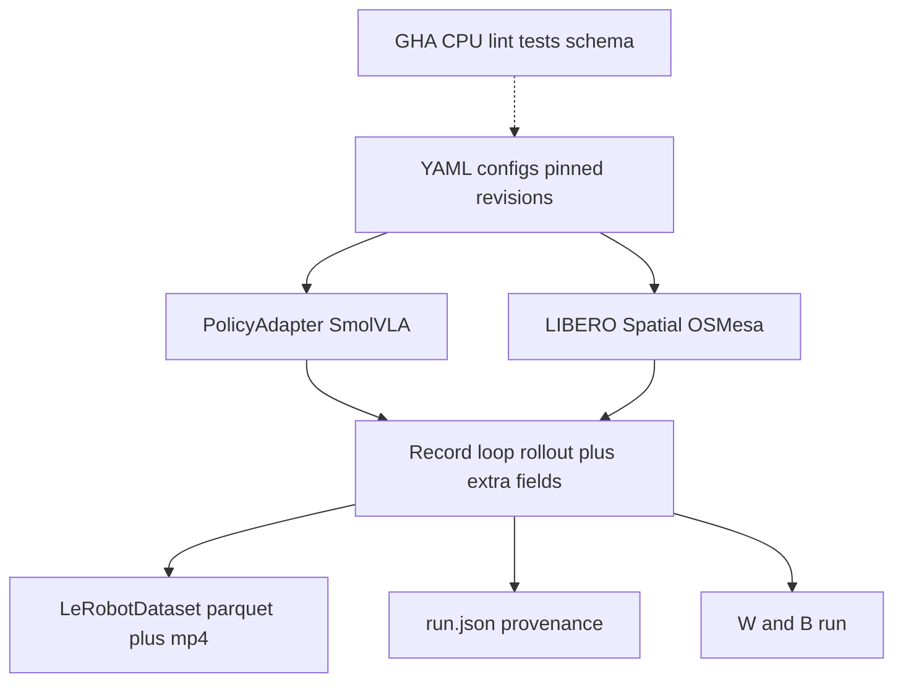

# Week 1 — Rollout infrastructure

This machine is a **Dell G16 with an RTX 4070 Laptop GPU (8 GB)**. That is the hard constraint. Week 1 stands up a professional pipeline around it, reproduces a LIBERO-Spatial baseline, and writes episodes to disk. No guard signals, no viewer, no perturbation injection.

## Why SmolVLA, not OpenVLA-7B

The brief says: start with a small open checkpoint that fits a free-tier session; scale up only after the record/eval loop works. On this GPU that is not a preference — OpenVLA-7B is the wrong first checkpoint.

- **VRAM.** SmolVLA (`HuggingFaceVLA/smolvla_libero`) is ~0.45–0.6B, ~1–2 GB at inference. OpenVLA-7B is ~14 GB in fp16. INT4 (~6–7 GB) plus LIBERO EGL (~0.5 GB+ per env) plus decode activations does not leave a safe margin on 8 GB. LeRobot itself documents CUDA/EGL collisions on 8 GB even for SmolVLA.
- **Native stack.** SmolVLA is a first-class LeRobot policy. One `lerobot-eval` / `rollout()` path, Hub checkpoints, Docker LIBERO image. OpenVLA LIBERO eval is a separate repo (`experiments/robot/libero/run_libero_eval.py`), four **suite-specific** finetuned checkpoints, bitsandbytes, and a known `.to()` / accelerate pin dance.
- **Repro target.** SmolVLA 0.45B paper: Spatial 90% / Object 96%. The Hub checkpoint is cited in the 80–100% band; an independent pinned repro lands **81.5% Spatial** (MuJoCo 3.3.2, OSMesa). OpenVLA paper Spatial is 84.7%, but maintainers warn numbers drift off A100. You cannot spend week 1 debugging 7B quantization and still record a corpus.
- **Policy-agnostic guard.** Backstop consumes observations and action chunks, not model internals. Swapping to OpenVLA later is a new adapter + config, not a rewrite. Week 1 proves the loop on the model that actually fits.

Do **not** load OpenVLA this week, even “just to compare.”

## Hardware and rendering (lock this in ADR-002)

| Knob | Value | Why |
|---|---|---|
| GPU | RTX 4070 Laptop, 8188 MiB | Measured on this host |
| Envs | `batch_size=1`, `max_parallel_tasks=1` | EGL/CUDA must not multiply |
| Render | `MUJOCO_GL=osmesa` default; EGL only if VRAM allows | Avoids 8 GB CUDA vs EGL fight; CPU render is slower and correct |
| MuJoCo | **pin 3.3.2** | 3.4+ breaks Spatial task-5 init-state settling (~3–4 pp silent drop) |
| Control | `relative` | Matches SmolVLA / LeRobot LIBERO default |
| Policy | `HuggingFaceVLA/smolvla_libero` (pin Hub revision in config) | Frozen; no training |
| Action exec | `n_action_steps=1` (from checkpoint `config.json`) | `chunk_size=50`; execute 1 step then re-query |
| Flow steps | start `num_steps=10` (checkpoint default); fallback `num_steps=1` if Spatial &lt; 70% | Independent repro: `num_steps=1` → 81.5% |
| Init | `init_states=true`, hard reset | Repro, not speed |
| Seed | `0` | Written into every artifact |

**Baseline recipe:** `libero_spatial`, 10 tasks × 10 episodes = 100. **In-tolerance:** 70–90% (covers HF “80–100%” and the 81.5% pinned repro; paper 90% is not this checkpoint). Below 70%: debug knobs before recording the corpus. Do not chase 90% for days.

If `num_steps=10` is slow or low, switch to the documented 81.5% recipe (`num_steps=1`, OSMesa, MuJoCo 3.3.2) and lock that in the ADR. Whichever recipe hits tolerance is the frozen eval contract.

## Architecture



`lerobot-eval` writes `eval_info.json` + MP4s. That is **not** enough. Week 3 needs per-step images, proprio, executed action, the predicted **chunk**, and later K samples. Week 1 therefore owns a thin **record loop** that calls LeRobot’s `rollout(..., return_observations=True)` (or equivalent step loop) and writes a LeRobot v3 dataset plus sidecar provenance.

## Repo layout (create from empty workspace)

Workspace today is only [Backstop_Project_Brief.pdf](Backstop_Project_Brief.pdf). Add:

> **Correction (superseded by ADR-002):** Python is **3.12**, not 3.11. LeRobot
> 0.6.x requires `>=3.12`; 3.11 will not install it. The layout below is otherwise
> accurate, plus `scripts/verify_corpus.py` and `tests/unit/test_rollout_loop.py`.

```text
backstop/
  pyproject.toml              # uv, python 3.12, ruff, pyright, pytest
  uv.lock
  .python-version             # 3.12 (LeRobot 0.6.x requires >=3.12)
  justfile
  Dockerfile                  # FROM huggingface/lerobot-gpu + libero-assets + this repo
  .github/workflows/ci.yml
  .pre-commit-config.yaml
  configs/
    metric.yaml               # false_stop_budget: 0.05
    eval/spatial_smoke.yaml   # 1 task, 2 episodes
    eval/spatial_baseline.yaml
    record/spatial_baseline.yaml
  src/backstop/
    __init__.py
    schema.py                 # Pydantic episode/frame/run contracts
    provenance.py             # git SHA, mujoco, policy revision, seed
    policy/adapter.py         # Protocol + SmolVLAAdapter
    env/libero.py             # make_env wrapper, OSMesa, pins
    record/loop.py            # rollout + dataset writer
    record/cli.py             # backstop-record
    eval/cli.py               # backstop-eval (thin wrapper)
    eval/report.py            # write eval.json; refuse raw-accuracy headline
  tests/unit/test_schema.py
  tests/contract/test_metric.py
  docs/adr/001-metric.md
  docs/adr/002-checkpoint.md
  docs/runbook.md
```

`just` recipes: `sync`, `lint`, `test`, `smoke`, `eval-spatial`, `record-spatial`. One command per stage.

**CI (GitHub Actions, CPU only):** ruff, pyright, pytest. Schema + metric-contract tests must fail if someone headlines raw accuracy or changes the 5% budget without editing the ADR. No GPU on GHA. Smoke/eval are local `just` jobs.

**W&B:** log `pc_success`, n_episodes, seed, policy revision, mujoco version. First baseline is a run, not a screenshot.

**HF Hub (optional this week):** local dataset under `data/lerobot/backstop_spatial_baseline/` is the exit criterion. `push_to_hub` only if a token exists; do not block week 1 on Hub.

## Episode schema (frozen this week)

Pydantic in `src/backstop/schema.py`, mirrored as LeRobot `features`:

Per frame:

- `observation.images.image` — agent view, video, uint8 HWC
- `observation.images.image2` — wrist, video, uint8 HWC
- `observation.state` — float32 (8,)
- `action` — float32 (7,) executed 6D delta + gripper
- `action_chunk` — float32 (chunk_size, 7) last policy chunk (pad/repeat last if needed)
- `action_chunk_samples` — float32 (K, chunk_size, 7), K=1 on full baseline
- `language` / LeRobot `task` — instruction string
- `success` — episode outcome copied onto frames or episode metadata

Per run sidecar `run.json`: git SHA, `policy.path` + Hub revision, MuJoCo version, `MUJOCO_GL`, seed, suite, n_episodes, `n_action_steps`, `num_steps`, eval success rate, dataset root.

K-sample note: SmolVLA is flow-matching, not a calibrated categorical. “Action distribution” = K independent chunks with different flow noise. **Smoke (2 episodes): K=4** to prove the field. **Full 100-episode baseline: K=1** (executed chunk only) so week 1 finishes. Week 2 perturbation corpus uses K=4. Do not invent logits the model does not emit.

## Implementation sequence

1. **Scaffold quality bar** — `uv init`, pin `lerobot[libero]`, `mujoco==3.3.2`, ruff/pyright/pytest, pre-commit, justfile, Dockerfile, CI, empty `__init__` packages.
2. **ADRs** — [docs/adr/001-metric.md](docs/adr/001-metric.md): headline is detection rate at **5% false-stop** on successful episodes; full curve published; reporter rejects raw accuracy. [docs/adr/002-checkpoint.md](docs/adr/002-checkpoint.md): SmolVLA vs OpenVLA table, pins above, tolerance band, fallback `num_steps=1`.
3. **Policy adapter** — `Protocol` with `predict_chunk(obs) -> (chunk, extras)`. `SmolVLAAdapter` loads Hub weights via LeRobot `make_policy`. Keep OpenVLA as an unimplemented stub so the swap stays obvious.
4. **Smoke** — `just smoke` → task_id 0, 2 episodes, OSMesa, `batch_size=1`. Pass = arm moves, 2 MP4s, `run.json` written. If CUDA OOM: confirm OSMesa, never raise parallel envs.
5. **`backstop-eval`** — 100 Spatial episodes, write `artifacts/eval/spatial_baseline/eval.json` + W&B. Compare to 70–90%. Apply `num_steps=1` fallback only if needed; record the chosen recipe in ADR-002.
6. **`backstop-record`** — same 100 episodes (or reuse if eval already returned observations) into LeRobotDataset.create / add_frame / save_episode / finalize. Include videos. Schema tests load one episode and assert required keys.
7. **Watch failures** — dump a `failures.md` list (task, seed, short note). You will not have 50 natural failures; watch all of them. Taxonomy is week 2.

## Explicitly out of week 1

Guard signals, trust head, perturbation injection, LIBERO-Object full suite, OpenVLA, viewer, policy training.

## Done when

- `just smoke` and `just test` pass
- Spatial success rate logged in W&B + `eval.json`, inside 70–90% or ADR updated with the honest miss and the locked fallback recipe
- `data/lerobot/backstop_spatial_baseline/` exists with images, state, action, action_chunk, provenance
- CI is green on CPU
- ADRs 001 and 002 committed

